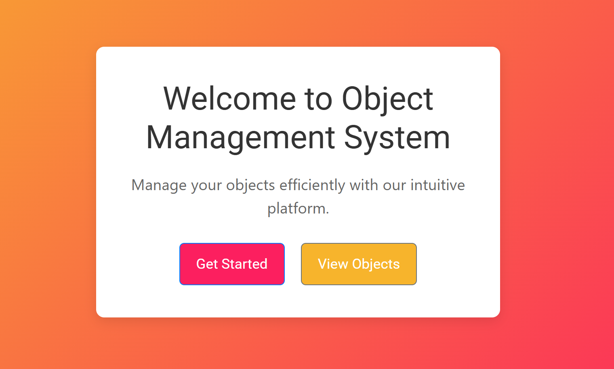
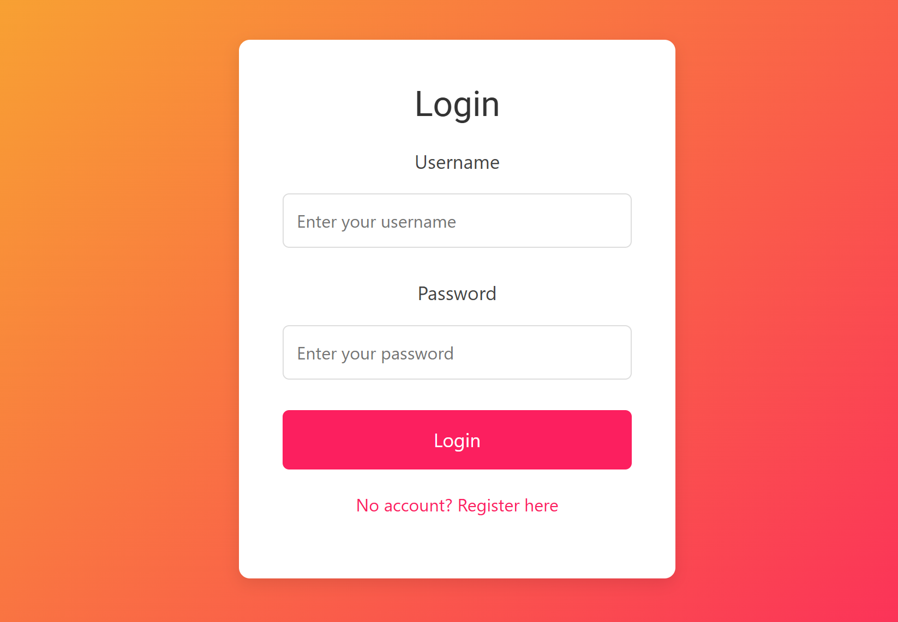
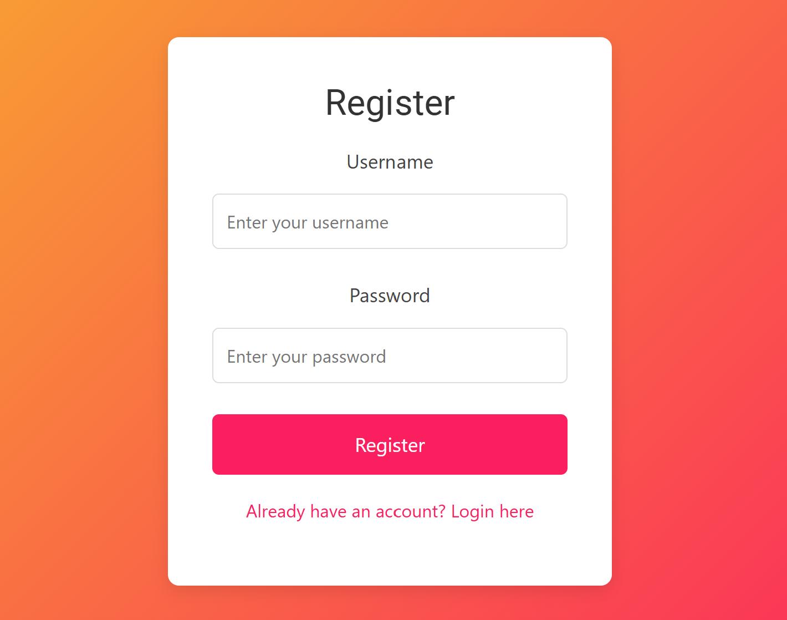
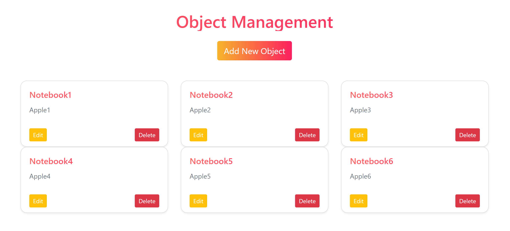

# Web Application - Auth and Object Management

This web application provides user authentication (login, registration) and basic management of objects (add, edit, delete, list). The application is built with Node.js (Express.js), MongoDB, Nuxt.js, and Bootstrap.

## Features
- User authentication (Login/Signup)
- CRUD operations for objects
- Simple and intuitive UI

## Tech stack
 - Node.js
 - Express.js
 - Nuxt.js
 - MongoDB with Mongoose
 - bcryptjs for password encryption
 - Bootstrap for styling

## Screenshots
### Home Page

### Login Page

### Register Page

### Object Page

## Prerequisites
```markdown
- Node.js >= 14.x
- MongoDB instance running locally or on cloud
```

## Installation
```bash
git clone <repository-url>
cd <project-directory>
npm install
```

## Configuration
```bash
MONGO_URI=<your_mongodb_connection_string>
JWT_SECRET=<your_jwt_secret_key>
```

## Startup
 - Start the backend server
```bash
npm run dev
```
 - Start the frontend server
```bash
npm run dev
```
## Usage

### 1. User Authentication
   - **Registration**: Users can create a new account by providing their username and password.
   - **Login**: Users can log in using their credentials (username and password).
   - Only logged-in users can access certain features such as object management.

### 2. Object Management
   - **Add Object**: Logged-in users can add new objects to their account.
   - **Edit Object**: Users can modify the details of their existing objects.
   - **Delete Object**: Users can remove objects they no longer need.
   - **View Object List**: Users can see a list of all objects they have created or managed.

### 3. Authentication Requirement
   - **Login Protection**: If a user is not logged in and tries to access the object management page, they will be automatically redirected to the login page.
   - This ensures that only authenticated users can access the object management functionalities (adding, editing, deleting objects).

## Project realization
[Backend](./backend/README.md)

[Frontend](./frontend/README.md)

